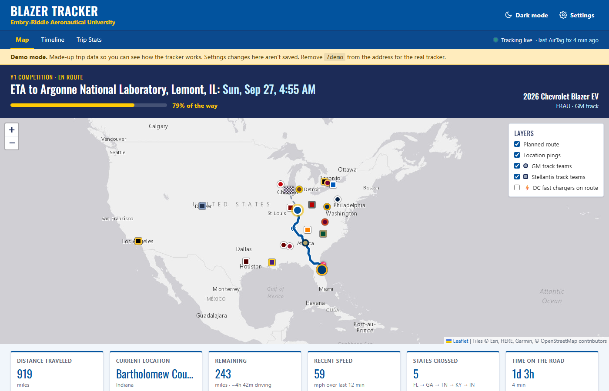
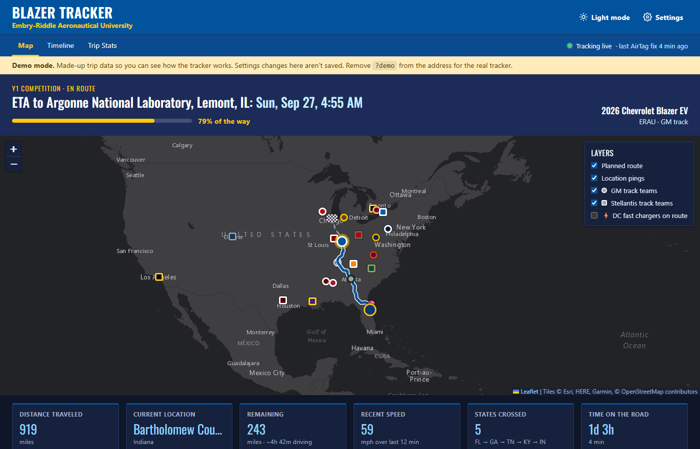
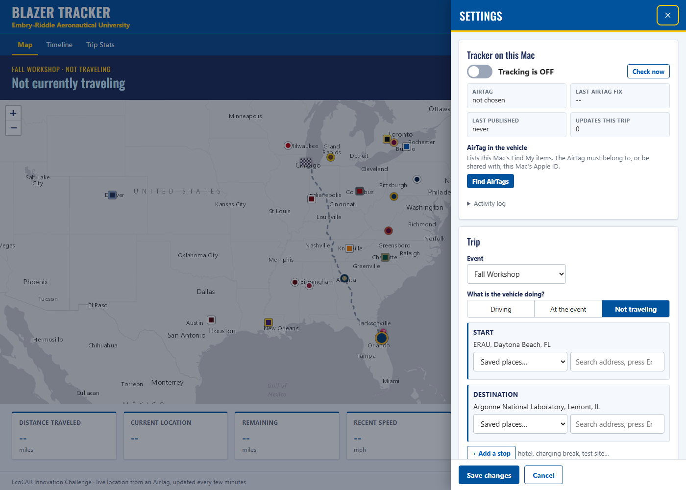

# EcoCAR Vehicle Tracker

A live, public map of where your EcoCAR vehicle is on the way to an event, powered by an AirTag in the car.

Anyone with the link sees the route, progress, ETA, the states crossed, and every EcoCAR Innovation Challenge school on the map. When the car is sitting at a competition, the page switches to "At Argonne since Tuesday 9:14 AM" instead.



Light mode follows Embry-Riddle's look, and there's a navy dark mode too. It follows your device's setting, or use the moon/sun button in the header.

<details><summary>Dark mode screenshot</summary>



</details>

Everything about the trip is edited from the **⚙ Settings** gear, top right: event, where the car is going, stops, what it's doing, vehicle name, colors and team.

**Try it first:** open your copy's page with `?demo` on the end (for example `https://YOUR-NAME.github.io/ecocar-vehicle-tracker/?demo`) to see a made-up trip.

---

## How it works (30-second version)

```
 AirTag in the car ──► Find My on a Mac ──► this tracker (runs on that Mac)
                                                │  every ~2 min, if the car moved
                                                ▼
                                   your GitHub repo ("tracker-data" branch)
                                                │
                                                ▼
                     public page on GitHub Pages  ◄── team, sponsors, family
```

- **You need a Mac** for the tracker part. Apple only lets a Mac or iPhone see where an AirTag is, and this reads the Mac's Find My app. No Mac? See [No Mac?](#no-mac) below.
- **The public page is free** (GitHub Pages) and needs nothing running on your side except that Mac.

---

## Quick start (about 15 minutes, once)

### Step 1: Get your own copy on GitHub

1. Sign in to GitHub. Make a free account if you need one.
2. On this repository's page, click the green **Use this template** button, then **Create a new repository**.
3. Name it something like `ecocar-vehicle-tracker`, leave it **Public**, and click **Create repository**.

   > The team can own it instead: pick your team's GitHub organization as the owner.

### Step 2: Turn on the public page

1. In your new repo, go to **Settings**, then **Pages** in the left sidebar.
2. Under **Build and deployment**, set **Source** to **Deploy from a branch**. Set **Branch** to **main**, the folder to **/ (root)**, then click **Save**.
3. Wait about a minute and refresh. GitHub shows your link, like `https://YOUR-NAME.github.io/ecocar-vehicle-tracker/`.
4. Open that link with `?demo` on the end to check that it works.

### Step 3: Make a key that lets the Mac update the page

This is a GitHub "fine-grained personal access token". It can only touch this one repo.

1. Go to **GitHub, then your profile picture, Settings, Developer settings, Personal access tokens, Fine-grained tokens**, and click **Generate new token**.
   (Or use the **Make a key on GitHub** link in Settings > Publishing to GitHub on the Mac, which fills most of this in.)
2. **Token name:** `EcoCAR tracker`. **Expiration:** 1 year.
3. **Resource owner:** you, or your team's organization if the repo lives there.
4. **Repository access:** **Only select repositories**, then pick your tracker repo.
5. **Permissions:** click **Add permissions** and choose **Contents**. Set it to **Read and write**.
6. Click **Generate token** and **copy it now**. GitHub won't show it again. You'll paste it in step 5.
7. If the repo belongs to an organization, an org owner may need to approve the token. GitHub will say so on the token page.

> Treat the token like a password. Don't paste it into chats or commit it anywhere. The tracker keeps it only on the Mac.

### Step 4: Put the tracker on the Mac

1. On the Mac, open your repo on GitHub and click **Code**, then **Download ZIP**. Unzip it somewhere easy, like **Documents**.
2. Make sure the **Find My** app on that Mac shows the car's AirTag under **Items**. If the AirTag belongs to someone else, see [Sharing the AirTag](#sharing-the-airtag-with-the-tracker-mac).
3. Double-click **Start Tracker.command** in the unzipped folder.
   - **"Cannot be opened because it is from an unidentified developer"**: right-click it and choose **Open**, then **Open** again. You only have to do this once.
   - **"Install command line developer tools?"**: click **Install**, wait for it to finish, then double-click **Start Tracker** again.
4. A Terminal window opens (leave it open). Your browser opens the tracker with the **Settings** panel already showing.



### Step 5: Fill in Settings (on the Mac)

1. **Tracker on this Mac:** click **Find AirTags**, then **Use this** next to the car's AirTag.
2. **Trip**, and **Vehicle & team:** set the event, what the car is doing, start, stops, destination and departure time.
3. **Publishing to GitHub:** type your repo as `owner/name` (for example `erau-ecocar/ecocar-vehicle-tracker`), paste the key from step 3, and click **Save & test connection**. You should see **Connected ✓**.
4. Click **Save changes** at the bottom.
5. Back at the top, flip the switch to **Tracking is ON**.

Open your public link without `?demo`. The car shows up after the first AirTag update.

---

## Using it

Everything below happens in **⚙ Settings**. Open it from the gear, top right.

### Changing settings from any computer or phone
You don't have to be at the tracker Mac. Open the public page, click the gear, and under **Editing** paste the same GitHub key from step 3, then click **Unlock editing**. After that, **Save changes** updates the page for everyone within a few minutes, and the tracker Mac picks up the change on its own.

- Without the key, the gear is view-only. Anyone can look, but only people with the key can change things.
- Tick **Remember on this device** only on your own computer. Otherwise the key is forgotten when you close the tab. **Lock** forgets it right away.

### Before each trip
1. Double-click **Start Tracker.command** on the Mac, if it isn't already running.
2. On the Mac, in Settings: click **Start a new trip** to clear the last trip's dots. They're saved in `tracker/archive/` on the Mac.
3. Set **Driving**, the start, any stops (hotel, charging break) and the destination, then click **Save changes**.
4. Make sure the switch says **Tracking is ON**.

### At the event
Choose **At the event**, set the **Venue**, and click **Save changes**. The page then shows how long the car has been there, and warns if it wanders off.

### Between events
Choose **Not traveling** and click **Save changes**. If you fill in a future departure time, the page shows "Next trip to … departs …".

### Keep the Mac happy
- **Plugged in, lid open, connected to Wi-Fi**, and signed in to the Apple ID that can see the AirTag.
- Leave the Terminal window open. Closing it stops tracking.
- The tracker keeps the Mac from sleeping while it runs.
- If the Mac restarts, double-click **Start Tracker.command** again. It remembers whether tracking was on.

### What the page's colors mean
| Status dot | Meaning |
|---|---|
| 🟢 **Tracking live** | AirTag seen in the last 20 minutes |
| 🟠 **Update delayed** | 20–90 minutes since the last sighting. Normal on empty highways. |
| 🔴 **No recent update** | Over 90 minutes. Check the Mac, or the car is somewhere with no iPhones around. |

AirTags don't have GPS. They report their position when any nearby iPhone passes by, so updates come every few minutes on busy roads and can pause in empty areas.

---

## Sharing the AirTag with the tracker Mac

The AirTag must show up in the tracker Mac's Find My. If it belongs to someone else (an advisor, last year's PM):

1. The owner opens **Find My** on their iPhone, goes to **Items**, taps the AirTag, then **Share This AirTag**, and adds the Apple ID used on the tracker Mac.
2. Accept the invitation on an iPhone or iPad signed in to that Apple ID.
3. After a few minutes, the AirTag appears under **Items** in Find My on the Mac, and **Find AirTags** in Settings will list it.

**Also share it with the drivers.** iPhones warn people when an unknown AirTag travels with them. Up to 5 people can share an AirTag. Anyone it's shared with won't get the alert. Otherwise, warn the drivers that it may pop up.

---

## No Mac?

The tracker has to read Find My on a Mac. Options, easiest first:

| Option | What it takes | Notes |
|---|---|---|
| **Borrow a Mac** | Any Mac made in the last ~6 years: a lab Mac, an advisor's, a teammate's old MacBook | Share the AirTag to the Apple ID on it. Best choice. |
| **Rent a cloud Mac** | Services like MacinCloud, roughly $1/hour or $25–50/month | Sign in to iCloud on it, share the AirTag to that Apple ID, and run the tracker there. Works while you're all on the road. |
| **Phone in the car instead of an AirTag** | A spare phone that stays plugged in and shares its GPS | More accurate and more frequent than an AirTag, but not built into this tracker yet. It would be a nice project for someone. |
| **Advanced: no Mac at all** | Open-source tools like FindMy.py | Still need a Mac once to pull the AirTag's keys, and they break when Apple changes things. Not supported. |

---

## Customizing

| To change… | Edit |
|---|---|
| Schools on the map, their colors, or logos | `data/teams.json`. To show a logo instead of a dot, put a square image in `assets/logos/` and add `"logo": "assets/logos/file.png"` to that school. |
| One-click places and event names in Settings | `data/places.json` |
| Your team logo in the page header | Put the image in `assets/`, then set `"logo": "assets/your-logo.png"` under `team` in `data/config.json` |
| Default vehicle name, color, first trip | `data/config.json` (the starting point for a new copy), or just use ⚙ Settings |
| DC fast charger layer | It uses the free DOE Alternative Fuels Station Locator `DEMO_KEY` (10 lookups/hour per viewer). For heavy use, get a free key and put it in `data/config.json` as `map.nrel_api_key`. |

Edits made on GitHub's website go live on the public page in about a minute.

---

## Troubleshooting

| Problem | Fix |
|---|---|
| **The gear says "View only"** | That's normal for visitors. To edit, paste the GitHub key under **Editing** (see [Changing settings from any computer](#changing-settings-from-any-computer-or-phone)). |
| **"Find My's cache folder doesn't exist"** | Open the Find My app once, and make sure you're signed in to iCloud (**System Settings**, then your name). |
| **"macOS blocked access to Find My's cache"** | **System Settings > Privacy & Security > Full Disk Access**: turn on **Terminal**, then quit Terminal and double-click Start Tracker again. |
| **"…may be encrypted by a newer macOS"** | Newer macOS versions can lock Find My's cache. Check for a newer version of this tracker, or run it on a Mac with an older macOS. Please report which macOS version you're on. |
| **The AirTag isn't in the list** | Check Find My, then **Items**, on that Mac. If it's not there, it isn't shared with this Apple ID (see [Sharing the AirTag](#sharing-the-airtag-with-the-tracker-mac)). |
| **"GitHub rejected the token/key"** | It expired or was mistyped. Make a new one (step 3). On the Mac, paste it in **Publishing to GitHub**. On other computers, click **Lock**, then unlock with the new key. |
| **"token can't write to …"** | Check the repo name is `owner/name` exactly, and the token has **Contents: Read and write** for that repo. |
| **The public page doesn't update** | GitHub caches the data for up to 5 minutes. The page refreshes itself every minute. |
| **The public page says "Not currently traveling" even though you saved a trip** | The Mac hasn't published yet. In Settings on the Mac, click **Save & test connection**, and check the red error line under **Tracker on this Mac**. |
| **The map is blank** | Check your internet connection. The map uses free online map tiles and routing. |

---

## For developers

```
index.html, assets/viewer.*   The page (plain HTML/JS + Leaflet, no build step). Light theme follows ERAU's ERNIE portal.
assets/settings.js            The gear panel: trip/vehicle settings, the Mac's tracker controls, web editing
data/config.json              Starting trip settings (the Mac's live copy is data/live/, which is git-ignored)
data/teams.json, places.json  Schools and saved places
data/demo/                    Made-up trip for ?demo
tracker/tracker.py            Mac app: local server for the page + Find My polling + publishing
tracker/findmy.py             Reads Find My's cache (~/Library/Caches/com.apple.findmy.fmipcore)
tests/                        python3 -m unittest discover tests  (no Mac needed; uses sample Find My files)
Start Tracker.command         Double-click launcher (runs tracker.py under caffeinate)
```

- **Python standard library only.** GitHub calls go through `curl`, so python.org's Python works without its certificate installer.
- **Publishing:** each update force-pushes one commit holding `config.json` and `location_history.json` to the `tracker-data` branch. The public page reads it from `raw.githubusercontent.com`. Location updates never rebuild GitHub Pages, and the repo stays small.
- **Web edits:** the gear commits only `config.json` to `tracker-data` from the browser (using the key the person pasted), keeping the location history. Every save stamps `updated_at`. Before publishing, and every check interval, the Mac adopts a newer `config.json` from GitHub, so web and Mac edits don't overwrite each other. The latest save wins.
- **Token:** it's stored only in `tracker/local_settings.json`, which is git-ignored and never served. If the GitHub CLI is installed and logged in, the tracker uses `gh auth token` when no token is set.
- **Local server:** listens on `127.0.0.1:8765` only. Change the port with `TRACKER_PORT`.
- **Running it yourself:** `python3 tracker/tracker.py`. It also starts on Windows or Linux, so you can work on the pages there; only the AirTag reading needs a Mac.
- **Outside services:** OSRM (routing), Esri (map tiles), OpenStreetMap Nominatim (address search in Settings), DOE station locator (chargers). All are free and need no key.
